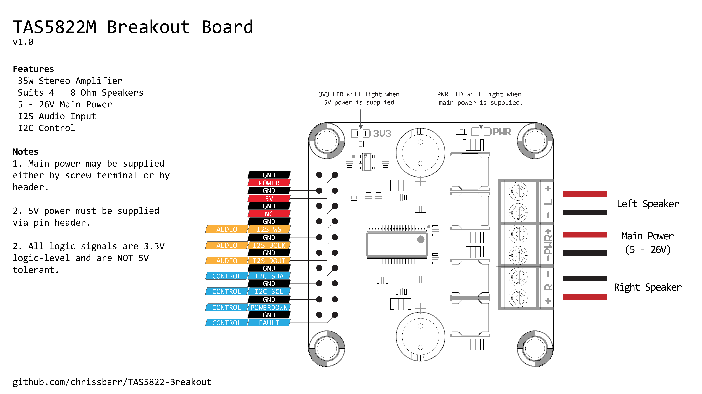
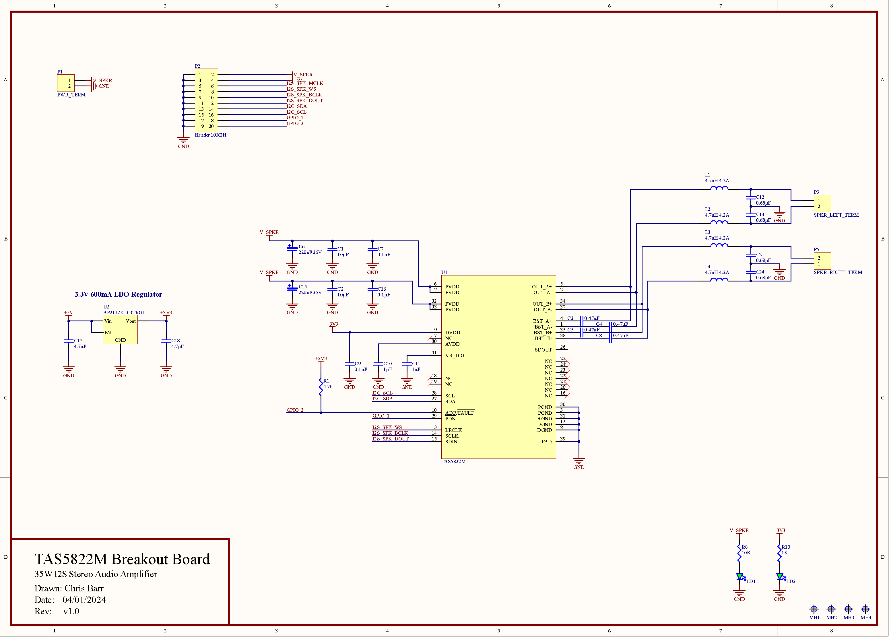

# TAS5822 Breakout Board
An easy-to-use breakout board for the TI TAS5822 I2S audio DAC.

The TAS5822 is a stereo Class-D digital audio amplifier with I2S audio input and I2C control. It can drive 4/6/8 Ohm speakers at up to 35W.

The TAS5822 is compatible with digital audio sources that can stream data in the I2S format. This includes popular microcontroller families such as ESP32, STM32, or some single-board computers such as the Raspberry Pi.

This breakout board is an easy way to add high-quality digital audio to an embedded project.

An Arduino library that implements control of the TAS5822 via I2C is available [here](https://github.com/chrissbarr/TAS5822-Arduino-Library).

An example of playing audio over Bluetooth using an ESP32 is available [here](./Firmware/ESP32_Bluetooth_Example/).

The TAS5822M Breakout Board is available for purchase [here](https://aus3d.com.au/products/tas5822m-breakout-board).

## Images

## Pinout
| Pin | Description | Notes |
| --- | --- | --- |
| P1-1 | Main Power | 5 - 26V Power Input. This is the also connected to pin header P2-2. Provide main power through either P2 or P1. It is not necessary to use both. |
| P1-2 | GND | |
| P3-1 | Left Speaker + | |
| P3-2 | Left Speaker - | |
| P5-1 | Right Speaker - | |
| P5-2 | Right Speaker + | |
| P2-1,3,5,7,9,11,13,15,17,19 | GND | Multiple ground pins are provided to simplify wiring and to allow good signal integrity. All of these pins are connected together. It is not typically required to connect them all. |
| P2-2 | Main Power | 5 - 26V Power Input. This is the also connected to screw terminal P1. Provide main power through either P2 or P1. It is not necessary to use both. |
| P2-4 | 5V Power | 5V Power Input. Can be 4.3V - 6.0V. Regulated down to 3.3V internally to power TAS5822M. |
| P2-6 | NC | Not connected. Reserved for future use. |
| P2-8 | I2S_WS | I2S Word Select. Also called left-right clock (LRCLK) or frame sync (FS). 3.3V logic level. |
| P2-10 | I2S_BCLK | I2S Bit Clock. Also called serial clock (SCLK). 3.3V logic level. |
| P2-12 | I2S_DIN | I2S Data In. 3.3V logic level. |
| P2-14 | I2C_SDA | I2C Serial Data. Pullup to 3.3V is required on host board. 3.3V logic level. |
| P2-16 | I2C_SCL | I2C Serial Clock. Pullup to 3.3V is required on host board. 3.3V logic level. |
| P2-18 | PDN | TAS5822 Power Down Input. Driving this signal low will shutdown the TAS5822M. Must be driven high to enable operation. 3.3V logic level. |
| P2-18 | ADR/FLT | TAS5822 Address / Fault. Resistor R1 between ADR and 3.3V sets I2C address. Replace R1 to change I2C address if required. This signal can also be monitored to detect faults. Refer to TAS5822 datasheet. 3.3V logic level. |

## References
* [TAS5822 Arduino Library](https://github.com/chrissbarr/TAS5822-Arduino-Library)
* [ESP32 A2DP Bluetooth Example](./Firmware/ESP32_Bluetooth_Example/)
* [TI TAS5822 Details](https://www.ti.com/product/TAS5822M)
* [Purchase](https://aus3d.com.au/products/tas5822m-breakout-board)

